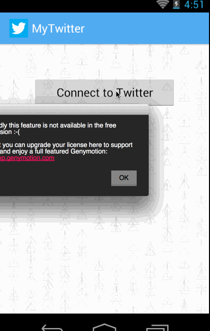

#twitter-client
==============

a simple Twitter client app that supports viewing a Twitter timeline and composing a new tweet.

Time spent: 25hrs+

User stories:

* [x] User can sign in to Twitter using OAuth login
* User can view the tweets from their home timeline
  * [x] User should be able to see the username, name, body and timestamp for each tweet
  * [x] User should be displayed the relative timestamp for a tweet "8m", "7h"
  * [x] User can view more tweets as they scroll with infinite pagination
  * [x] Optional: Links in tweets are clickable and will launch the web browser (see autolink)
* User can compose a new tweet
  * [x] User can click a “Compose” icon in the Action Bar on the top right
  * [x] User can then enter a new tweet and post this to twitter
  * [x] User is taken back to home timeline with new tweet visible in timeline
  * [x] Optional: User can see a counter with total number of characters left for tweet
* [x] Advanced: User can refresh tweets timeline by pulling down to refresh (i.e pull-to-refresh)
* Advanced: User can open the twitter app offline and see last loaded tweets
  * [x] Tweets are persisted into sqlite and can be displayed from the local DB
* [x] Advanced: User can tap a tweet to display a "detailed" view of that tweet
* [x] Advanced: User can select "reply" from detail view to respond to a tweet
* [x] Advanced: Improve the user interface and theme the app to feel "twitter branded"
* [x] Bonus: User can see embedded image media within the tweet detail view
* [] Bonus: Compose activity is replaced with a modal overlay
* 

Walkthrough of all user stories:

GIF created with [LiceCap](http://www.cockos.com/licecap/).

---------------

#twitter-client week 2

Required User Stories:

* [x] User can switch between Timeline and Mention views using tabs.
  * [x] User can view their home timeline tweets.
  * [x] User can view the recent mentions of their username.
  * [x] User can scroll to bottom of either of these lists and new tweets will load ("infinite scroll")
  * []  Optional: Implement tabs in a gingerbread-compatible approach
* [x] User can navigate to view their own profile
  * [x] User can see picture, tagline, # of followers, # of following, and tweets on their profile.
  * [x] User can click on the profile image in any tweet to see another user's profile.
  * [x] User can see picture, tagline, # of followers, # of following, and tweets of clicked user.
* [x] Profile view should include that user's timeline
  * [] Optional: User can view following / followers list through the profile

Completed Advanced User Stories:

* [x] Advanced: Robust error handling, check if internet is available, handle error cases, network failures
* [x] Advanced: When a network request is sent, user sees an indeterminate progress indicator
* [x] Advanced: User can "reply" to any tweet on their home timeline
  * [x] The user that wrote the original tweet is automatically "@" replied in compose
* [x] Advanced: User can click on a tweet to be taken to a "detail view" of that tweet
* [x] Advanced: Improve the user interface and theme the app to feel twitter branded
  * [x] Replace tabs with view pager
  * [x] Add icons, colors
  * [x] Added card ui for tweet item
  
Incomplete Advanced User Stories:

* [] Advanced: User can take favorite (and unfavorite) or reweet actions on a tweet
* [] Advanced: User can search for tweets matching a particular query and see results
* [] Bonus: User can view their direct messages (or send new ones)

Walkthrough of user stories:

GIF created with [LiceCap](http://www.cockos.com/licecap/).
